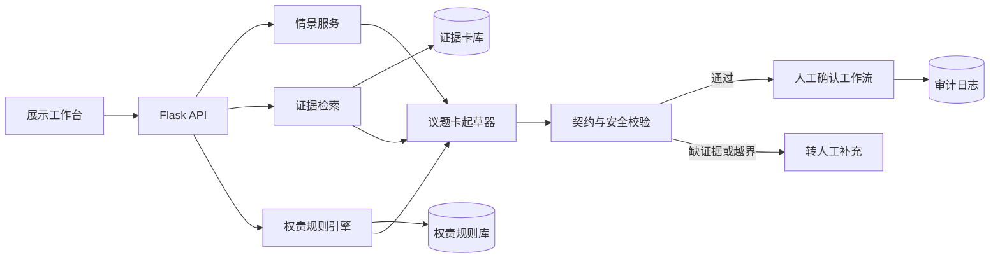
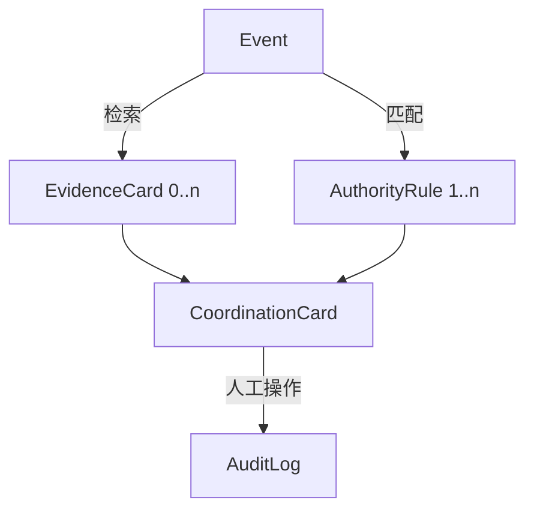

# 南站协同官：比赛展示版工程设计 v1

## 1. 建设目标和范围

南站协同官服务于南京南站案例教学。面对“列车晚点与停车场外溢”这类跨主体情景，它把线索整理为可核验的事件证据包，匹配事先人工维护的权责规则，生成待人工确认的协同议题卡。评委或学生可以扮演交控万物现场主管、综管办值守人员、铁路／枢纽联络人，依次查看证据、边界和建议，作出确认、拒绝或升级的选择。

比赛版的交付条件是：从选择 SC-01 到完成一次人工确认和复盘，现场演示可在 3 分钟内跑完；页面能清楚区分“事实依据”“模拟设定”“模型草稿”和“人工决定”。

| 做 | 不做 |
| --- | --- |
| 可溯源案例问答、模拟事件、权责提示、协同议题卡、人工确认、审计日志 | 真实派单、自动执法、真实数据接入、跨系统写入、权限授权、绩效结论 |
| 已审阅证据卡的检索和引用 | 将访谈中的判断自动当作法规或正式授权 |
| 对一个主情景做深度推演 | 先做“全能多智能体平台”或三种场景同时上线 |

## 2. 已有工件的复用结论

| 现有资产 | 可复用内容 | 本项目中的使用方式 |
| --- | --- | --- |
| `../实务应用/aifit_demo-0606-0610/artifacts/case_struct/` | Flask 服务、JSON 输入输出、结构化抽取和离线回退思路 | 作为 `card-service` 的服务骨架；接口改为事件和协同议题卡。 |
| `../实务应用/aifit_demo-0606-0610/artifacts/interview/` | Flask、`/healthz`、静态 UI、可选 ASR、默认不改 canonical 数据 | 复用 UI 结构和演示模式；语音输入只作为可选项，不进入 P0。 |
| `../实务应用/aifit_demo-0606-0610/orchestrator/` | ToolBox 的预算、计时、降级和 `human_review` 传播 | 每一步记录状态；关键校验失败后停止生成“可确认”卡片。 |
| `../实务应用/aifit_demo-0606-0610/knowledge/eval/golden_set.json` | 正反例回归集、误放行优先于回答率的测试纪律 | 改造成南站案例的边界回归集。 |
| 本仓的访谈、调研反馈和政策文件 | 证据卡的候选来源 | 仅在研究团队审阅、脱敏和标注后进入展示版数据目录。 |

早期规划中提到的 `interview-robot` 和 Next.js 工程不在当前工作区。当前可核实的可复用前端是 AIfit 的 Flask + 静态网页工件。因此 P0 采用 Python + Flask + 静态 HTML/CSS/JavaScript，避免为换前端框架增加风险。后续如需多页面或多人协作，再单独评估迁移。

## 3. 系统结构



系统不采用开放式“多智能体自由协商”。比赛版是可审计的固定工作流：

1. 选择情景、角色和事件线索。
2. 事件服务读取 `Event`，标出其中的模拟字段。
3. 检索器返回已批准的 `EvidenceCard`，没有证据则返回空结果。
4. 规则引擎按事件类型、空间范围、动作和数据等级匹配 `AuthorityRule`。
5. 起草器组装 `CoordinationCard`。优先使用模板；启用模型后，模型也只能返回同一 JSON 结构。
6. 校验器检查来源、规则、风险标签和人工闸门。失败时输出“需要人工补充”，不生成确定性建议。
7. 用户确认、拒绝或升级。系统写入不可改的演示审计日志，不向外部系统发出指令。

## 4. 数据边界与知识账本

### 4.1 四类数据

| 类型 | 保存位置 | 可否进入比赛版 | 要求 |
| --- | --- | --- | --- |
| 原始访谈、录音转录、会议纪要 | 研究资料库，不进演示仓 | 否，除非另行审阅 | 可能含个人信息、内部判断和未经核实的说法。 |
| 审阅后的证据卡 | `data/evidence-cards.json` | 可以 | 保留 `source_id`、段落或时间位置、摘录、事实／观点属性、脱敏状态和审阅人。 |
| 公开制度和政策 | `data/evidence-cards.json` | 可以 | 写入标题、版本、条款位置和访问日期；不要把政策概括成超出原文的授权。 |
| 模拟事件与样例回执 | `data/scenarios/` | 可以 | `data_status` 固定为 `simulated`，不与真实成效混用。 |

### 4.2 入库流程

1. 研究组在原始资料中选定可用于案例展示的段落。
2. 删除姓名、手机号、车牌、精确轨迹、未公开合同信息和可识别的内部工单号。
3. 每个可用段落制作一张 `EvidenceCard`，标明它是事实陈述、受访者观点、研究者解释还是模拟设定。
4. 另一位成员抽检来源定位和脱敏结果，状态改为 `approved`。
5. 只有 `approved` 卡片能被检索器返回。卡片更新时递增 `knowledge_version`。

`source-registry.json` 只登记候选来源和处理要求，不复制受访者原话。正式证据卡需要研究团队逐条确认后再建立。

## 5. 关键对象和状态机

六份 JSON Schema 位于 `contracts/`。四类业务对象、审计记录和“需要人工补充”响应的关系如下：



`CoordinationCard.status` 的状态迁移固定为：

```text
draft → pending_human_confirmation → confirmed
                                  ├→ rejected
                                  └→ escalated
```

- `draft`：服务生成但尚未通过全量校验。
- `pending_human_confirmation`：证据、规则和人工闸门均完整，可以向用户展示。
- `confirmed`：角色用户明确确认“建议用于模拟推演”。这不是对现实行动的授权。
- `rejected`：用户认为建议或依据不适用，必须记录原因。
- `escalated`：需要更高层级、更多材料或真实主体核对；演示版到此停止。

## 6. 权责判断和模型约束

权责判断不是大模型任务。`AuthorityRule` 使用下列字段：`event_type`、`spatial_scope`、`proposed_action`、`initiator_roles`、`authority_level`、`data_class`、`required_human_roles`。`initiator_roles` 表示谁可以发起模拟议题；`required_human_roles` 表示哪些角色必须分别确认，才能使卡片进入 `confirmed`。规则引擎的结论只能是：

- `within_service_scope`：可由服务方在合同和 SOP 范围内处理，仍保留审计记录。
- `coordination_required`：系统可以起草协同请求，必须由指定角色确认。
- `restricted`：涉及执法、跨主体数据或未证实权责；只显示边界和升级路径。
- `unknown`：资料不足；不猜测责任主体。

模型只用于两件事：基于已返回证据生成易读摘要；把模板化字段表述成协同议题卡草稿。模型输出必须符合 `coordination-card.schema.json`，并满足：

- 每项事实性主张通过 `evidence_refs` 追溯到至少一个 `source_id`；
- 不能增加 `AuthorityRule` 未给出的处置动作；
- `human_gate` 永远为 `true`；
- 输出出现“立即执法”“自动派单”“强制共享”等表述时，安全校验器直接拒绝；
- 模型超时、无密钥或 JSON 解析失败时，回退到模板卡；证据或规则不足时，返回 `ManualReviewRequired`，而不是生成引用为空的协同议题卡。

## 7. API 第一版

接口细节见 `contracts/openapi.yaml`。P0 只实现下面五个端点：

| 方法 | 路径 | 用途 |
| --- | --- | --- |
| `GET` | `/healthz` | 返回服务和知识版本。 |
| `GET` | `/api/v1/scenarios` | 列出可演示的模拟情景。 |
| `GET` | `/api/v1/scenarios/{scenario_id}` | 读取情景、事件和可扮演角色。 |
| `POST` | `/api/v1/cards/draft` | 基于事件和用户选择生成待确认协同议题卡；依据不足时返回“需要人工补充”。 |
| `POST` | `/api/v1/cards/{card_id}/decisions` | 记录确认、拒绝或升级；确认者必须属于卡片的 `required_confirmations`。仅写本地演示日志。 |

`POST /cards/draft` 的最小请求体：

```json
{
  "scenario_id": "SC-01",
  "event_id": "NJS-DEMO-SC01-E01",
  "acting_role": "operator_supervisor",
  "proposed_action": "request_cross_party_confirmation"
}
```

服务端不能接受 `external_dispatch=true` 一类参数；`acting_role` 必须是命中规则允许的发起者。接口中也不提供 Webhook、短信、邮件或第三方业务系统凭据。

## 8. P0 的目录建议

```text
nanjing-south-hubcoord/
├── app.py                     # Flask 入口
├── services/
│   ├── scenario_service.py
│   ├── evidence_retriever.py
│   ├── authority_resolver.py
│   ├── card_composer.py
│   ├── card_validator.py
│   └── audit_store.py
├── contracts/                  # 复制本启动包中的 schema
├── data/
│   ├── source-registry.json
│   ├── evidence-cards.json
│   ├── authority-rules.json
│   └── scenarios/
├── static/                     # 基于 AIfit 工件的演示 UI
├── tests/
│   ├── test_contracts.py
│   ├── test_authority.py
│   ├── test_card_composer.py
│   └── test_golden_cases.py
└── eval/golden-cases.json
```

不建议现在直接复制整个 AIfit 仓库。先从 `artifacts/case_struct` 和 `artifacts/interview` 提取 Flask 服务、静态 UI、健康检查和测试组织方式，避免把诊断平台中与本案无关的冻结活地图、图谱和端口编排一并带入。运行时以 `evidence-cards.json` 和 `authority-rules.json` 为唯一事实来源；`sc-01-delay-parking-overflow.json` 只保存情景、事件和对两类全局数据的引用。

## 9. 可验证的验收标准

| 维度 | P0 通过条件 |
| --- | --- |
| 来源 | SC-01 每张卡均显示来源类型、可展开的 `evidence_refs → source_id`、知识版本和“模拟／脱敏”标识。 |
| 边界 | “直接处罚”“向未授权方开放数据”“自动向外部系统派单”三类请求全部得到 `restricted` 或 `escalated`。 |
| 人工闸门 | 没有人工 decision 记录时，卡片不能显示为“已执行”或“已闭环”。 |
| 降级 | 禁用模型或检索无结果时，服务返回模板卡或“资料不足”，不编造。 |
| 可演示 | 现场断网时，SC-01、模板卡、规则和回归集仍可运行。 |
| 诚实表述 | 页面、日志和演示脚本均标明它是案例教学与模拟推演。 |

## 10. 开发节奏

先做确定性链路，再接模型。理由很简单：本案的差异不在聊天能力，而在证据、权责、确认和复盘之间的边界。

第一周完成数据契约、SC-01、规则和模板卡。第二周完成 Flask API、静态工作台和人工确认日志。第三周加入可溯源检索、模型起草和回归集。第四周只处理演示稳定性、引用抽检和答辩材料，不扩展真实系统集成。
