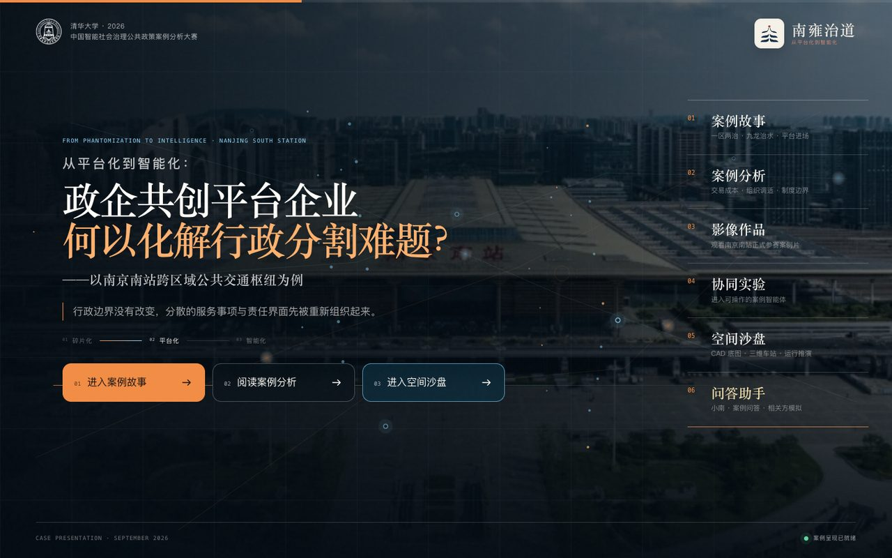
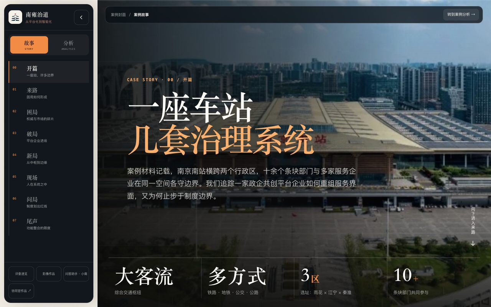
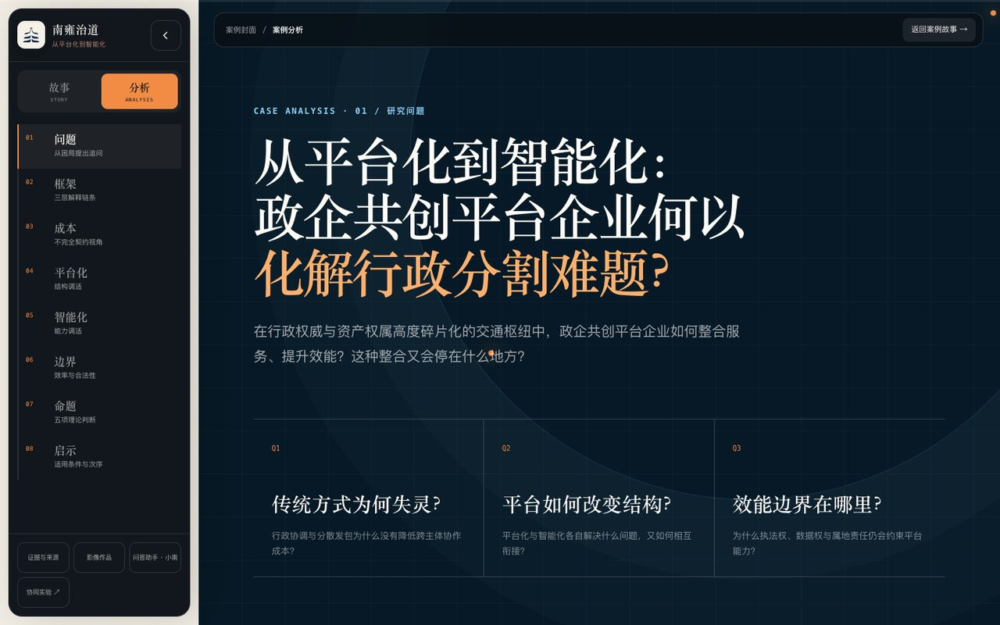
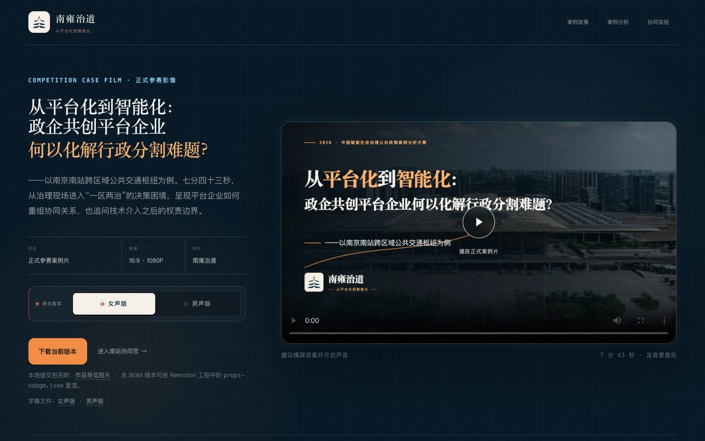
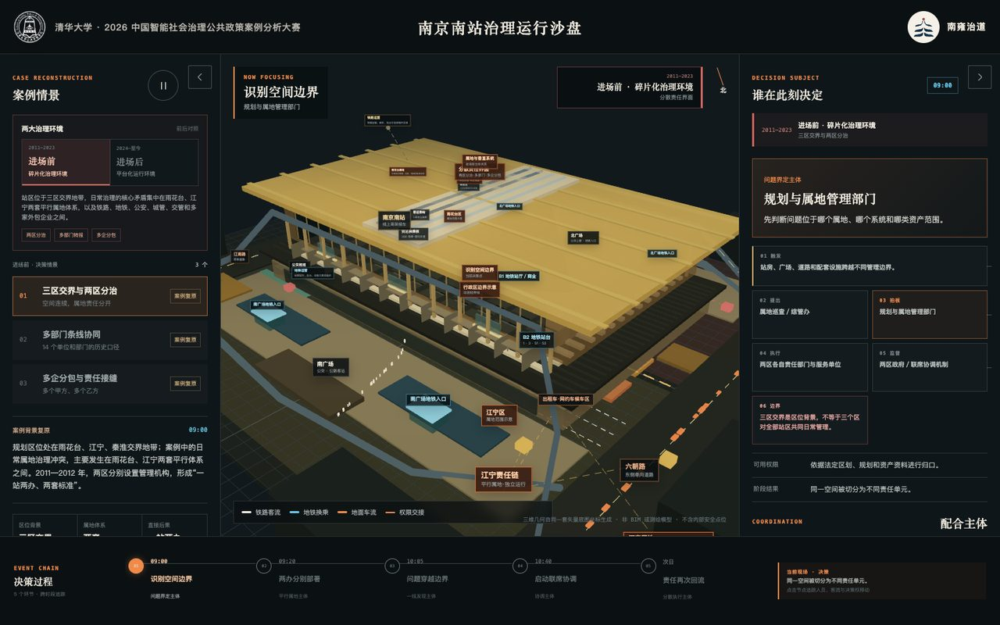
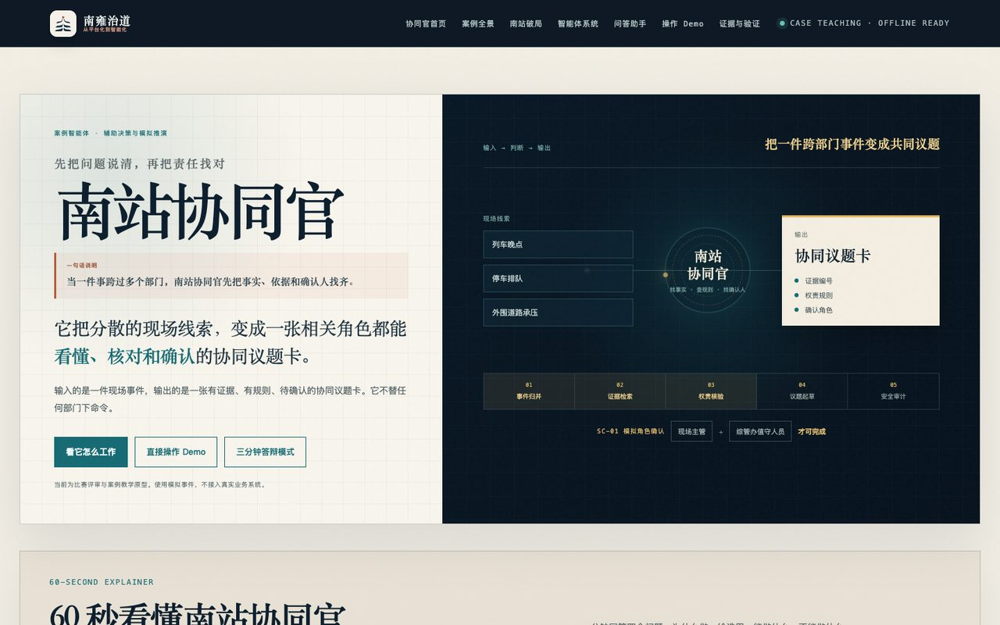
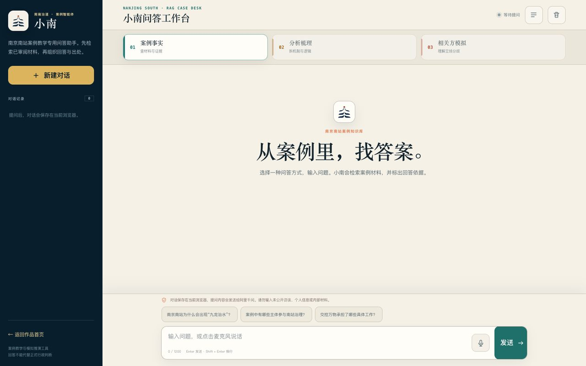

# 南雍治道 · 南京南站案例作品合集

> **2026 中国智能社会治理公共政策案例分析大赛 · 参赛作品**
> 主题：从平台化到智能化——政企共创平台企业何以化解行政分割难题？
> 案例：南京南站跨区域公共交通枢纽。

---

## 在线预览（GitHub Pages 已上线）

👉 **https://xuyiheng-code.github.io/nanjingnan-station-case-study/**

`index.html` 即作品主站入口，页面内容与线上主站 `https://hubcoord.cn/` 完全一致。下面是该作品主站的完整截图。

### 01 / 主站封面

主站封面采用南京南站航拍图为底，叠加 Canvas 信号粒子动画，配三阶段演进（碎片化 → 平台化 → 智能化）与六入口索引（案例故事 / 案例分析 / 影像作品 / 协同实验 / 空间沙盘 / 问答助手）。

### 02 / 案例故事

案例故事以 SC-01 现场为主线，呈现「一座车站，几套治理系统」的真实张力：大客流、多方式、三区两治、跨省道路权与协同复盘。

### 03 / 案例分析

案例分析分 8 节拆解问题：传统方式为何失灵 → 平台如何改变结构 → 效能边界在哪里 → 政企共创启示。

### 04 / 影像作品

7 分 43 秒正式参赛案例片，1080P，内嵌 HTML5 播放器与字幕。原始 .mp4 留在仓库外以避免 GitHub 100MB 单文件限制。

### 05 / 空间沙盘（CAD）

三维车站沙盘，CAD 底图叠加案件场景与决策时间线，可在浏览器内交互切换治理结构与决策主体。

### 06 / 协同实验（案例智能体 Demo）

南站协同官案例智能体的可操作 Demo：60 秒看协同官工作流 + 三分钟实录 + 议题卡样张。

### 07 / 问答助手 · 小南

基于已审阅案例材料的 RAG 问答助手，支持事实核对、机制分析、相关方模拟与中文语音输入。

---

## 仓库目录

| 目录 | 内容 | 建议先看 |
| --- | --- | --- |
| `00-提交说明/` | 创新作品说明表、提交包清单、压缩前检查表、文件清单 | 说明表 |
| `01-线上一致网页/` | 与线上主站一致的本地版，含案例故事、分析、影像、协同实验、空间沙盘、问答助手 | `index.html` |
| `02-视频作品/` | 正式参赛案例片字幕、封面、关键帧；作品导览短片字幕与封面（>100MB 原片不进 Git） | `01-正式参赛案例片/` |
| `03-可运行源码/` | 南站协同官智能体工程 · 南京南站 3D 空间沙盘 · 案例视频 Remotion 工程 | 各项目 README |
| `04-设计与视觉资产/` | Logo、海报、设计系统、视觉输出 | `design-system/` |
| `05-验证与截图/` | 网页截图、视频终审报告、提交前复核材料 | `网页截图/` |
| `99-历史归档/` | 旧版目录（整合包结构与早前尝试），保留供回溯 | 不必打开 |

## 在线入口

- **作品合集首页**：https://xuyiheng-code.github.io/nanjingnan-station-case-study/
- **线上主站**：https://hubcoord.cn/
- **三维沙盘**：https://cad.hubcoord.cn/
- **小南问答助手**：https://qaq.hubcoord.cn/assistant.html

## 本地打开

1. 直接双击 `index.html`（GitHub Pages 入口），浏览器会加载主站封面并跳转。
2. 想直接进入主站目录，可打开 `01-线上一致网页/index.html`。
3. 若只看案例正文 → `01-线上一致网页/story.html`。
4. 若只看案例分析 → `01-线上一致网页/analysis.html`。
5. 若查看正式案例片 → `01-线上一致网页/film.html`，或 `02-视频作品/01-正式参赛案例片/`。
6. 若浏览空间沙盘 → `01-线上一致网页/cad/app.html`，或线上入口 `https://cad.hubcoord.cn/`。

## 仓库约定

- 原始 `.mp4` 视频超过 100 MB 不进 Git（女声版 ~299MB、男声版 ~300MB、导览版 ~138MB），网页展示使用 `01-线上一致网页/assets/films/` 下的智能体演示版（约 6-7 MB）。
- `99-历史归档/` 与 `node_modules/` 已通过根目录 `.gitignore` 排除。
- 本仓库根目录的 `index.html` 同时作为 GitHub Pages 入口；如需独立部署可改用 `01-线上一致网页/`。

## 团队与版权

作品主体由徐亦恒（XuYiheng-code）完成，南京道器相济人工智能科技有限公司支持工程化与部署。提交包、源码、Logo 与封面受团队内部版权约束；如需在团队外部引用，请先联系作者获得授权。
