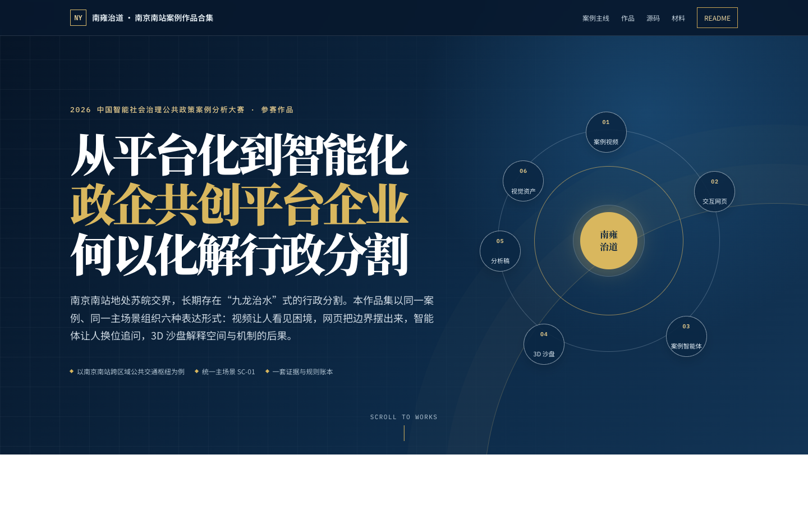
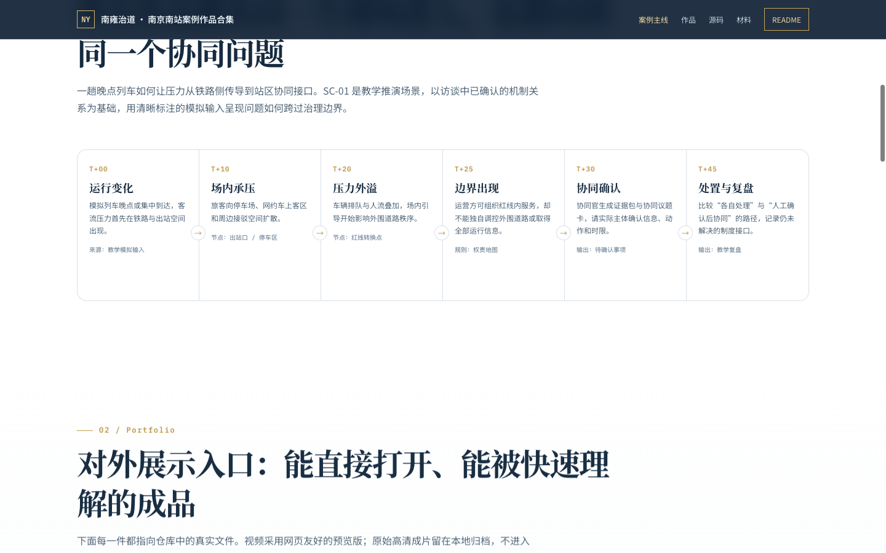
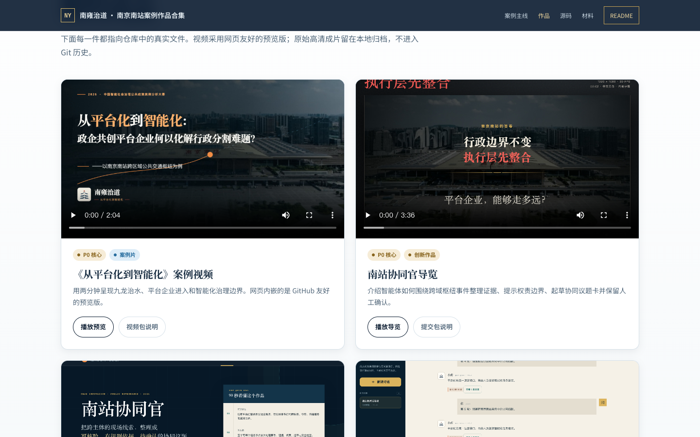
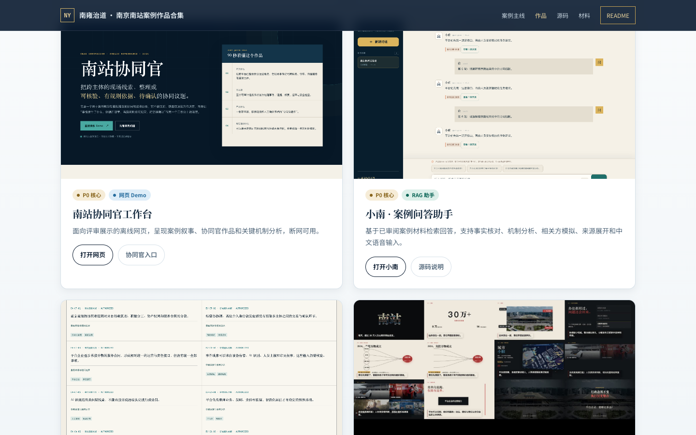
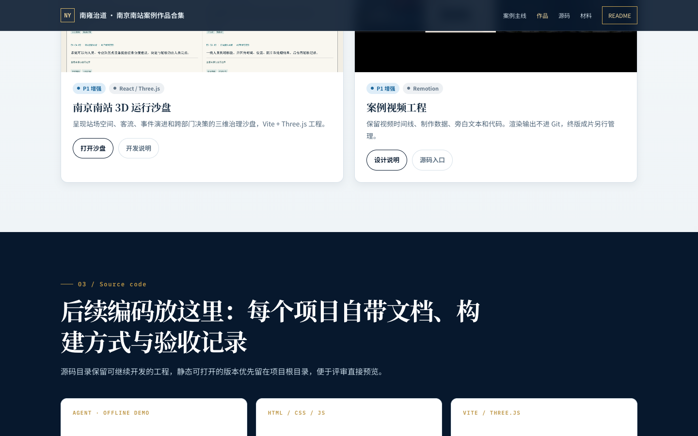
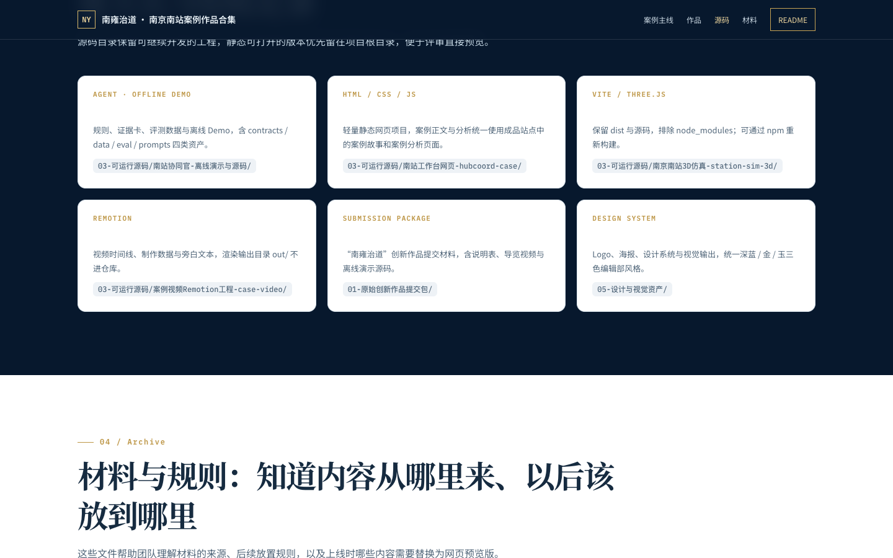
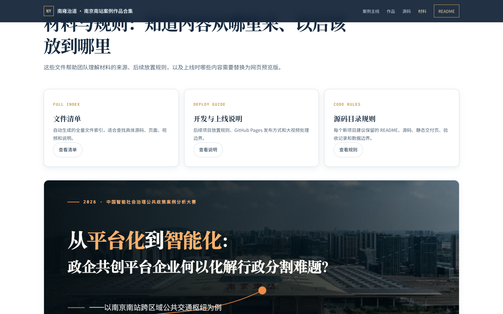
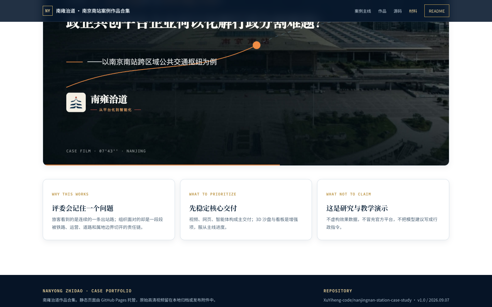

# 南雍治道 · 南京南站案例作品合集

> **2026 中国智能社会治理公共政策案例分析大赛 · 参赛作品**
> 主题：从平台化到智能化——政企共创平台企业何以化解行政分割难题？
> 案例：南京南站跨区域公共交通枢纽。

---

## 在线预览（GitHub Pages 已上线）

👉 **https://xuyiheng-code.github.io/nanjingnan-station-case-study/**

`index.html` 是仓库的对外门户，复用南站协同官参赛工作台的设计系统。下面是该页面的完整截图：

### 01 / Hero — 主标题与六行星轨图

### 02 / Shared story world — SC-01 时间线 T+00 → T+45

### 03 / Portfolio — 作品卡片（视频、网页、智能体、3D 沙盘）

### 04 / Source code — 源码入口（深色段 6 项目）

### 05 / Archive — 材料与规则 + footer

---

## 作品要点

南京南站地处苏皖交界，长期存在「九龙治水」式的行政分割。本作品围绕三条主线展开：

1. **从平台化到智能化**——以万物云（交控万物）入场为节点，刻画政企共创平台企业如何承接行政分割留下的协调真空；
2. **协同官智能体**——围绕跨域枢纽事件整理证据、提示权责边界、起草协同议题卡，并保留人工确认；
3. **小南案例问答助手**——基于已审阅的案例材料做 RAG 检索回答，支持事实核对、机制分析、相关方模拟与中文语音输入。

理论框架与制度分析详见 [`01-原始创新作品提交包/00-请先阅读.md`](./01-原始创新作品提交包/00-请先阅读.md) 与 [`04-网页成品与展示材料/`](./04-网页成品与展示材料/) 下各交付稿页面。

## 目录速览

| 目录 | 内容 | 建议先看 |
| --- | --- | --- |
| [`01-原始创新作品提交包/`](./01-原始创新作品提交包/) | 创新作品「南雍治道」提交包、导览视频与离线演示源码 | `00-请先阅读.md` |
| [`02-终版案例视频/`](./02-终版案例视频/) | 案例片终版、字幕、封面与制作说明 | `README.md` |
| [`03-可运行源码/`](./03-可运行源码/) | 工作台网页、3D 沙盘、Remotion 视频工程、智能体离线演示 | `README.md` |
| [`04-网页成品与展示材料/`](./04-网页成品与展示材料/) | 已交付的 HTML 页面、参赛规划页、截图 | 子目录说明 |
| [`05-设计与视觉资产/`](./05-设计与视觉资产/) | Logo、海报、设计系统、视觉输出 | `README.md` |
| [`00-总览/`](./00-总览/) | 文件清单、上线说明、过程文档 | `文件清单.txt` |

## 在线入口

- **作品合集首页**：https://xuyiheng-code.github.io/nanjingnan-station-case-study/
- **小南 · 案例问答助手**：https://qaq.hubcoord.cn/assistant.html
- **南站工作台网页（本地版）**：[`03-可运行源码/南站工作台网页-hubcoord-case/index.html`](./03-可运行源码/南站工作台网页-hubcoord-case/index.html)
- **南京南站 3D 运行沙盘**：[`03-可运行源码/南京南站3D仿真-station-sim-3d/`](./03-可运行源码/南京南站3D仿真-station-sim-3d/)
- **案例视频 Remotion 工程**：[`03-可运行源码/案例视频Remotion工程-case-video/`](./03-可运行源码/案例视频Remotion工程-case-video/)

## 视频预览

仓库内置两支网页友好型预览视频（原始高清版留在本地 `02-终版案例视频/`，不进入 Git 历史）：

- [`web-media/nanjing-south-case-preview.mp4`](./web-media/nanjing-south-case-preview.mp4) — 案例片《从平台化到智能化》
- [`web-media/hubcoord-guide-preview.mp4`](./web-media/hubcoord-guide-preview.mp4) — 协同官导览

## 仓库约定

- 原始 `.mp4` 视频超过 100 MB 不进 Git，网页展示使用 `web-media/` 下的压缩版；
- `06-GitHub-Pages上线包/` 与 `node_modules/` 已通过根目录 `.gitignore` 排除；
- 本仓库根目录的 `index.html` 同时作为 GitHub Pages 入口；如需独立部署可改用 `06-GitHub-Pages上线包/`；
- 提交规范的开发约定见 [`00-总览/后续开发与GitHub上线说明.md`](./00-总览/后续开发与GitHub上线说明.md)。

## 团队与版权

作品主体由徐亦恒（XuYiheng-code）完成，南京道器相济人工智能科技有限公司支持工程化与部署。提交包、源码、Logo 与封面受团队内部版权约束；如需在团队外部引用，请先联系作者获得授权。
